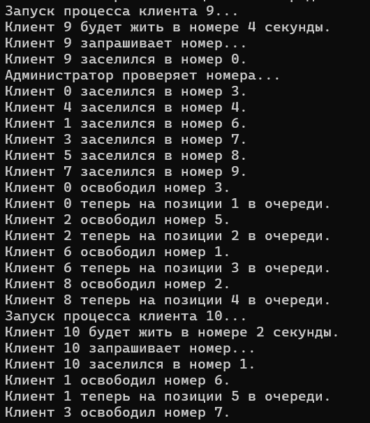

# Муравьев Антон Юрьевич, БПИ229

## Вариант 16

## Условие

**Задача о социалистической гостинице.** В гостинице **10** одноместных номеров. Клиенты гостиницы снимают номер на одни или
несколько суток (задается при создании клиента). Если в гостинице нет свободных номеров, клиенты не уходят, а устраиваются на
рядом с гостиницей на скамейках и ждут в порядке очереди, пока любой из номеров не освободится (других гостиниц в городе нет).
**Создать многопроцессное приложение, моделирующее работу гостиницы.**
*Каждого клиента и гостиницу (точнее ее администратора) моделировать отдельным процессом*

## Компиляция и запуск

Для компиляции программы используется следующая команда в wsl:

```shell
gcc -o <name> <file.c>
```

Для запуска:

```shell
./<name>
```

### 4-5

**Выбранный вариант работы семафоров:**

* Множество процессов взаимодействуют с использованием именованных POSIX семафоров. Обмен данными ведется через
  разделяемую память в стандарте POSIX.

Программа моделирует работу гостиницы с использованием многопроцессности и семафоров. В гостинице есть 10 номеров и 15 клиентов, которые хотят заселиться.

1. Структура `Hotel` представляет собой гостиницу. Она содержит массив `rooms`, представляющий номера гостиницы, и массив `queue`, представляющий очередь клиентов, ожидающих заселения.
2. Процесс `admin` моделирует работу администратора гостиницы. Администратор периодически проверяет номера и, если номер свободен и в очереди есть клиенты, заселяет первого клиента из очереди в номер.
3. Процесс `customer` моделирует поведение клиента. Клиент может быть в одном из двух состояний: либо он заселен в номер, либо он ожидает в очереди. Если клиент не в очереди, он запрашивает номер. Если все номера заняты, клиент устраивается в очередь. Если номер свободен, клиент заселяется в номер. После пребывания в номере на определенное время, клиент освобождает номер и возвращается в очередь. Также клиент при создании рандомно генерирует число 1 или 2 (количество ночей, которые он проведет в номере). 1 ночь = 2 секундам задержки.
4. В главном процессе `main` создается разделяемая память для структуры гостиницы и инициализируется семафор. Затем запускается процесс администратора и процессы для каждого из клиентов. Главный процесс затем переходит в состояние ожидания.
5. Семафор используется для синхронизации доступа к данным гостиницы. Когда процесс хочет изменить данные гостиницы, он должен сначала захватить семафор. Если семафор уже захвачен другим процессом, процесс будет ждать, пока семафор не освободится.
6. Обработчик сигнала `handle_sigint` и функция `cleanup` используются для корректного завершения программы и освобождения ресурсов при получении сигнала прерывания.

**Пример работы программы:**



### 6-7

**Выбранный вариант работы семафоров:**

* Множество процессов взаимодействуют с использованием неименованных POSIX семафоров расположенных в разделяемой памяти. Обмен данными также ведется через разделяемую память в стандарте POSIX.

Основная работоспособность программы не изменилась.

1. Структура `Hotel` представляет собой гостиницу. Она содержит массив `rooms`, представляющий номера гостиницы, и массив `queue`, представляющий очередь клиентов, ожидающих заселения. Также в структуре `Hotel` теперь присутствует семафор `sem`, который используется для синхронизации доступа к данным гостиницы.
2. Процесс `admin` моделирует работу администратора гостиницы. Администратор периодически проверяет номера и, если номер свободен и в очереди есть клиенты, заселяет первого клиента из очереди в номер. Для синхронизации доступа к данным гостиницы администратор использует семафор `sem`.
3. Процесс `customer` моделирует поведение клиента. Клиент может быть в одном из двух состояний: либо он заселен в номер, либо он ожидает в очереди. Если клиент не в очереди, он запрашивает номер. Если все номера заняты, клиент устраивается в очередь. Если номер свободен, клиент заселяется в номер. После пребывания в номере на определенное время, клиент освободил номер и возвращается в очередь. Клиент также использует семафор `sem` для синхронизации доступа к данным гостиницы.

Вывод программы также остался прежним.
